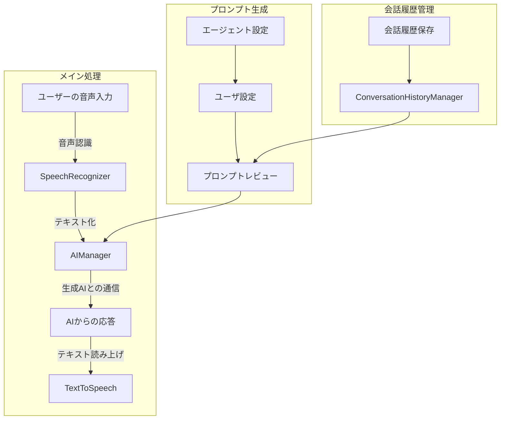

# README.md

# Android Voice App

このプロジェクトは、音声対話アプリケーションを作成するためのAndroidアプリです。チャットスタイルのUIでユーザーの音声を認識し、OpenAI APIを利用して自然な対話を実現します。

## 機能

- チャットUI: メッセージをチャット形式で表示し、対話の流れを視覚化
- 音声認識: 日本語音声を自動認識してチャットメッセージとして表示
- AI対話: OpenAI APIを利用した自然な対話生成
- テキスト読み上げ: AIの応答を自然な音声で読み上げ
- システム音抑制: ビープ音を最小限に抑えた快適な対話体験
- **新機能**: 会話履歴の保存と管理

## セットアップ

1. プロジェクトをクローン
2. Android Studioでプロジェクトを開く
3. 必要なSDKと依存関係をインストール
4. OpenAI APIキーを設定（下記参照）
5. アプリをビルドして実行

## OpenAI APIキーの取得方法

1. OpenAIのアカウント作成
   - [OpenAI](https://platform.openai.com/)にアクセス
   - アカウントを作成（メールアドレスの確認が必要）

2. APIキーの取得
   - ログイン後、右上のプロフィールから「View API keys」を選択
   - 「Create new secret key」をクリック
   - 生成されたAPIキーをコピー（このキーは一度しか表示されないので注意）

3. APIキーの設定
   - プロジェクトのルートディレクトリに`local.properties`ファイルを作成
   - 以下の行を追加：
     ```
     OPENAI_API_KEY=your_api_key_here
     ```

4. APIキーのテスト
   - 以下のPythonスクリプトを使用してAPIキーをテスト：
    test_OpenAI_APIKEY_check.py

## 使用方法

1. アプリを起動すると自動的に音声認識が開始されます
2. 話しかけると認識された音声がチャットメッセージとして表示されます
3. AIが応答を生成し、メッセージとして表示され自動で読み上げられます
4. 会話は自動的に継続され、自然な対話が可能です

## プロジェクト構成

```
android-voice-app
├── app/src/main
│   ├── java/com.example.voiceapp
│   │   ├── MainActivity.kt          # メインアクティビティ
│   │   ├── ChatAdapter.kt          # チャットUI管理
│   │   ├── ChatMessage.kt          # メッセージモデル
│   │   ├── SpeechRecognitionManager.kt # 音声認識
│   │   ├── TextToSpeechManager.kt  # 音声読み上げ
│   │   ├── UserSettingsFragment.kt # ユーザー設定
│   │   ├── AgentSettingsFragment.kt # エージェント設定
│   │   ├── PromptPreviewFragment.kt # プロンプトプレビュー
│   │   ├── AIManager.kt           # OpenAI API通信
│   │   ├── ConversationHistoryManager.kt # 会話履歴管理
│   ├── res
│   │   ├── layout
│   │   │   ├── activity_main.xml   # メインレイアウト
│   │   │   ├── activity_user_settings.xml # ユーザー設定レイアウト
│   │   │   ├── activity_agent_settings.xml # エージェント設定レイアウト
│   │   │   └── chat_message_item.xml # メッセージ表示
│   │   └── drawable
│   │       └── chat_bubble.xml     # チャットバブル
│   └── AndroidManifest.xml
└── local.properties              # APIキー設定
```

## アプリ構成図



## 技術スタック

- Kotlin & Android Jetpack
- OpenAI API (GPT-4)
- Android音声認識・読み上げAPI
- RecyclerViewによるチャット表示
- OkHttpによるAPI通信

## 人格化機能

このアプリケーションは、より自然な対話を実現するために、AIエージェントとユーザーの人格化機能を実装しています。

### エージェントの人格設定

- 名前
- 年齢
- 性別
- 性格ベース
- 性格詳細
- 話し方ベース
- 話し方詳細
- 応答の長さ
- 一貫したスタイル
- 共感
- 説明

### ユーザの人格設定

- 名前
- 年齢
- 性別
- 趣味

### 実装方法

1. システムプロンプトの強化
   - エージェントの性格設定を組み込んだプロンプト
   - ユーザープロファイル情報の活用

## 将来ビジョン

- 気分要素の追加：プロンプトを工夫して、生成AIからエージェントの喜怒哀楽を取得して、感情表現を実現する。UIや読み上げ音声に反映。
- ペットアプリへUI変更

- 「沈黙状態」の扱い検討
   - 話しかけ機能：音声に応答するだけでなく、定期的にセンサー情報などを元に隠れたリクエストを送り、応答を得ることで、話しかける機能を実装する
   - 音声認識の改善（Android標準以外の検討）
   - 沈黙状態からの発話への対処方法検討

- より自然な会話への検討
   - 読み上げ音声の改善
   - ユーザの初期設定を対話形式で構築
   - 会話ログからユーザの嗜好を取得・更新
   - AIモデルの選択とチューニング
   - プロンプトの圧縮、消費トークンとの兼ね合い
